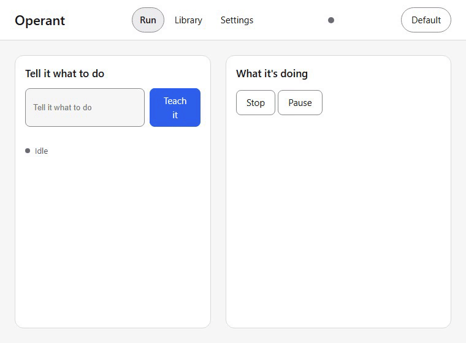
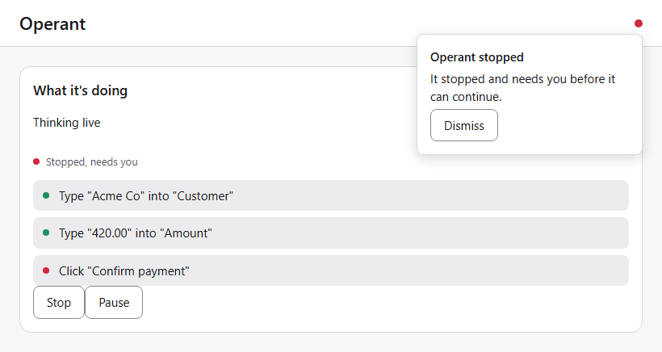
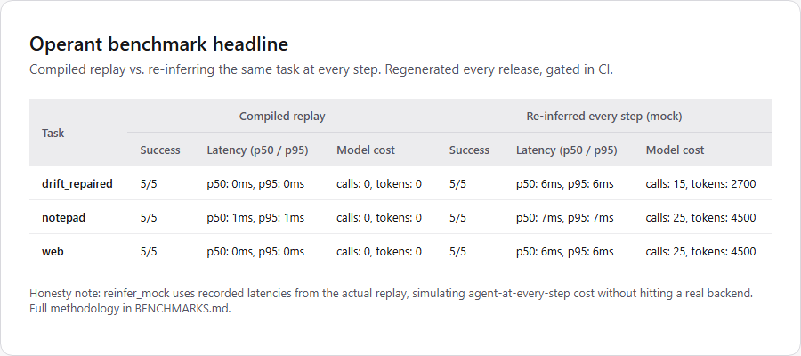
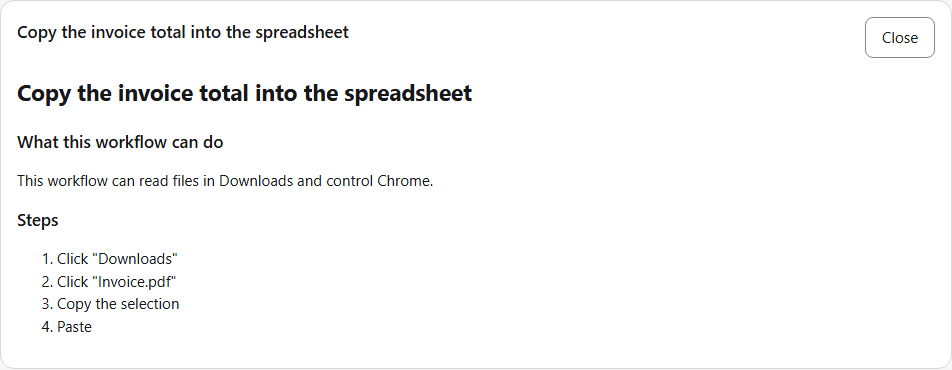

# Operant Launch Copy

Launch-day copy for v1.0.0. Drafted in Wave 1 (packet M1A) before the product
existed, when every measured number and every media file below was a named
placeholder; finalized in Wave 4 (packet V4) once BENCHMARKS.md was real and the 13
capture assets existed. Two placeholder shapes existed during drafting: an all-caps
underscored token in curly braces for a number, date, handle, or link, for example
`{BENCH_REPLAY_P50_MS}`, and an asset token in curly braces for a capture asset, for
example `{ASSET:04-replay.gif}`. Curly braces elsewhere were never a placeholder: the
TypeScript sample in the Show HN prepared answers uses curly-brace input references
such as `{invoice_date}` for the product's own workflow-input syntax, and it is
called out again at that sample so it cannot be mistaken for one. Section 6 is now a
resolution ledger, not a to-do list: it shows what each token resolved to and which
packet supplied the value. A few items have no real value yet (the social accounts,
the reframe post's own eventual URL); those are left as explicit `TODO` notes in
place, in prose, not as a bare `{TOKEN}`. Do not post anything out of this file that
still has an unfilled `{TOKEN}` in it, and resolve the plain-`TODO` items before the
post that needs them goes out.

Target launch date: 2026-07-11. Post from: HN, X, and Mastodon accounts that do not
exist yet; see section 6 for the standing TODO on all three.

Positioning source: `docs/PRD.md` (problem, thesis, launch cut) and `docs/ROADMAP.md`
(v1.0.0 scope, hook line). Voice source: `.claude/skills/operant-marketing/SKILL.md`.
Nothing below restates those files; it draws on them.

---

## 1. Show HN post

### Title options

All five are under HN's ~80-character guidance (checked at draft time; recount if the
name or thesis line changes).

1. `Show HN: Operant - teach your computer once, it runs forever without the model` (78 chars)
2. `Show HN: Operant, a desktop agent that compiles itself out of the loop` (70 chars)
3. `Show HN: Operant - the model is a compiler, not a runtime` (57 chars)
4. `Show HN: Operant, free local Windows agent, deterministic replay after one demo` (79 chars)
5. `Show HN: Operant - zero-code agent that turns a demo into an auditable script` (77 chars)

Recommendation: lead with 1 or 3. Option 1 sells the non-coder outcome, option 3 is
the purest developer hook. HN's own crowd tends to rank the plain-outcome title higher
before 9am and the thesis title higher in a technical cluster; either is defensible.

### Body

The literal text to submit. Plain text only, no markdown table, since HN does not
render one: the developer section below carries the thesis and a short honest
win/concede list, and points to the full comparison table and the prepared answers
for anyone who asks in the comments.

```text
Teach your computer once. It does it forever. No code. Free.

Operant is a free, open source desktop agent for Windows. Show it a task once, by
demonstration or by voice (copy rows from a supplier portal into a spreadsheet, file
a report in three places, whatever your Monday chore is), and it saves what it
learned as a workflow you can run again with one click or on a schedule. Setup never
touches a terminal: a guided wizard helps you download a free local model, sign in
with a ChatGPT or Claude account you already pay for, paste an access key, or just
try a demo first.

After the first time, Operant does not need the model again. Every later run plays
back from a small file on your own machine: nothing about your screen leaves the
computer, and there is no per-run bill. Same task, same result, model thinking live
versus running from memory:



The second time is instant.

Every run shows what it is about to do in plain English before it does it, any step
that changes something on your computer can be undone afterward, and one key stops
everything, instantly, no matter what Operant is doing when you press it.


That is the kill switch. Undo is real and tested underneath (write actions journal
their inverse before they run, the same mechanism `10-undo.gif` in the shot list
would show), but the "Undo last run" screen itself is not built in the UI yet, so
there is no honest capture of it to show here; see the Capture TODOs at the end of
this file.

That is the whole pitch if you are not a developer. Everything from here down is for
people who want to know how it actually works.

For developers: the thesis is that the model is a compiler, not a runtime.
Exploration should be probabilistic. Execution should not be. A 40-step workflow at
98 percent per-step model accuracy fails about 55 percent of the time in production;
probabilistic execution does not survive multiplication. So Operant explores a task
with a model once, or a few times with correction, then freezes the successful run
into a typed TypeScript file plus a signed manifest, guarded by invariant gates.
Replay after that is deterministic: zero model calls, zero network calls, both
asserted in CI, not just promised.

Compiling does five things in order: normalize (drop retried steps, fold human
corrections into the corrected path), parameterize (a literal becomes a typed input
when it varies across runs or matches a date, amount, path, email, or URL shape),
selectorize (score every stored selector: automation ID 100, name-plus-role path 60
minus 5 per path level, ordinal 20, a vision anchor at 0.85 template-match tolerance
as last resort), insert waits and postcondition asserts from what was actually
observed, then emit the TypeScript file and manifest. Every step carries a
plain-English intent string, and that string is not a developer comment: it is the
same text the plain-English view shows a non-coder, from the same file, with no
translation layer between what a developer reads and what a layman sees.

Gates, not vibes: every workflow runs against precondition, postcondition, and
safety checks in both teaching and replay. A hard safety invariant (credential
fields, payment or delete confirmations) is enforced by the runtime itself, not by
the workflow file, and no workflow can turn it off. When a compiled step fails
because the screen changed, Operant re-grounds that one step, proposes a patch diff,
waits for a human approval, then merges a new version with a changelog entry. The
workflow heals. It never silently mutates. That loop end to end:


And a safety halt, in plain language:



Trust features that sit below the planner, so no model state can block them: a kill
switch (default hotkey, freeze-to-halt measured at 2.5ms mid-run worst case across 50
trials against the real kill-switch code path, CI gate is under 100ms), a
journal-ahead undo log (the inverse is written before the action runs, so undo is a
real replay of real inverses, and anything irreversible is labeled before you run it,
not after), and anchor redaction (password fields and credential dialogs are blacked
out before any pixel touches disk, and a redaction error blocks the write instead of
falling through).

Numbers, not adjectives: compiled replay measured 1ms p50 per step (1ms p95) against
7ms p50 for the same task re-inferred every step: 7.0x, 15/15 replay runs passing on
unchanged UI across the 3-task suite. That pair is the notepad task, the slowest of
the three measured; the other two round to 0ms replay, an even wider margin. Full
methodology, including where the mock re-inference numbers use recorded latencies
instead of a live model, is in BENCHMARKS.md, regenerated every release and gated in
CI, not a one-time screenshot.



Bring your own model: 17 named backends (local runners Ollama, llama.cpp server, LM
Studio, vLLM, or any OpenAI-compatible endpoint by base URL; 11 cloud providers by
API key, Anthropic through OpenRouter; or sign in with a ChatGPT or Claude
subscription you already have). Default build makes zero network calls except
signed update checks, and that is air-gap-tested in CI, not asserted in a README.

Also in v1.0.0: a TypeScript SDK over the same file format, a CLI
(run/compile/dry-run/list/install/bench/doctor/explain), MCP in both directions
(Operant serves compiled workflows as MCP tools and consumes external MCP servers as
adapters), a Playwright importer, workflow composition (one workflow calling another
at the intersection of both grant sets), and a signed registry (Ed25519-verified,
unsigned workflows run dry-run only).

Honest, short version of how this compares: Operant wins on determinism, audit
trail, offline replay, drift repair, a genuine zero-code path, undo, and a
sub-100ms kill switch, and it is free. It concedes raw model quality on screens
it has never seen before to dedicated grounding teams, and it does not do mobile.
Full table, checked against each project's own docs:
https://github.com/AlpharomeroJL/operant#how-operant-compares

What is not here yet, plainly: macOS and Linux perception compile behind the trait
but are not tier 1 (Windows only at v1.0.0), no mobile device control, and one
maintainer.

Repo: https://github.com/AlpharomeroJL/operant (Apache 2.0)
Docs: https://alpharomerojl.github.io/operant/
Registry: https://github.com/AlpharomeroJL/operant-registry
Download: https://alpharomerojl.github.io/operant/guides/install.html

I will read every comment, including "why should I trust a kill switch you wrote
yourself," because that is a fair question and the answer is in the test suite, not
this post.
```

### Prepared answers for likely comments

Reference material, not for posting verbatim. Keep these current as the build
progresses; a wrong claim about a competitor in an HN comment is worse than no claim.

**"How is this different from Simular, UI-TARS Desktop, Open Interpreter, or UFO?"**

| | Operant | Simular | UI-TARS Desktop | Open Interpreter | UFO |
|---|---|---|---|---|---|
| Deterministic, model-free replay | Yes, CI-asserted | No, cloud execution | No, re-infers every step | No, re-infers every step | No, re-infers every step |
| Works fully offline after teaching | Yes | No | Partial | Partial | Partial |
| Self-heals on UI drift, human-approved | Yes | Not documented | Not documented | Not documented | Not documented |
| Full audit trail, hash-chained, exportable | Yes | Not documented | Not documented | Not documented | Not documented |
| No-code path for non-developers | Yes, wizard plus plain-English steps | Yes | No, developer tool | No, developer tool | No, research framework |
| One-click undo | Yes | Not documented | No | No | No |
| Kill switch under 100ms | Yes, latency-tested | Not documented | No | No | No |
| Price | Free, Apache 2.0 | Paid, per-seat | Free, open source | Free, open source | Free, research license |
| Raw exploration-time model quality | Conceding: dedicated grounding teams are likely ahead here | n/a | n/a | n/a | n/a |
| Mobile device control | Conceding: not at v1.0.0 | Not documented | No | No | No |

Checked: TODO, same date as README.md's own "How Operant compares" table, which is
still unfilled there as of this packet (V2 has not set it yet); set both together,
never invent a date here that README does not also carry. "Not documented" means no
public evidence either way was found, not a claim that the feature is absent.
Corrections welcome, especially anywhere "not documented" turns out to be wrong.
Live version, kept current: https://github.com/AlpharomeroJL/operant#how-operant-compares

**"Isn't this just RPA with extra steps?"**

Traditional RPA is hand-scripted from day one: a person builds the automation
selector by selector, and it breaks silently the moment the UI changes, with no
repair path beyond someone going back into the tool by hand. Operant is taught, not
scripted: a model watches the task once, or a few times with correction, and the
compiler writes the script, with alternate selectors (automation ID, name-plus-role,
ordinal, vision anchor) scored by stability, not just the first one that worked. When
the UI drifts, Operant does not fail silently: it re-finds the one broken step,
proposes a patch, and asks a human to approve it before merging. The output looks
like RPA, a deterministic script. How it gets written, and how it survives change, is
the actual product.

**"What does the compiled output look like? Is 'deterministic' just a marketing word?"**

A trimmed real example, from the compiler's own fixture suite, not invented for this
post:

```typescript
export default defineWorkflow({
  name: "notepad-invoice-note",
  version: "1.0.0",
  inputs: {
    invoice_date: input.date({ default: "2026-07-11", label: "Invoice date" }),
    amount: input.currency({ default: "142.50", label: "Amount" }),
  },
  steps: [
    step.click({
      intent: "Click the text editor",
      selectors: [
        { kind: "automation_id", value: "RichEditD2DPT" },
        { kind: "name_role_path", path: [{ role: "window", name: "Untitled - Notepad" }] },
        { kind: "ordinal_path", path: [{ role: "window", ordinal: 0 }] },
      ],
      risk: "read",
    }),
    step.type({ intent: "Type the invoice note", text: "Invoice {invoice_date} total ${amount}", risk: "write" }),
    step.assert({ intent: "Check that the note was written", expr: { op: "matches", regex: "^Invoice \\d{4}-\\d{2}-\\d{2} total \\$\\d+\\.\\d{2}$" } }),
  ],
});
```

(The `{invoice_date}` and `${amount}` above are the workflow's own input
placeholders, part of the product's template syntax, not a LAUNCH.md fill-in-later
token.)

Determinism is enforced two ways, not just claimed: the replay executor links
against a backend-free crate, so a model call during replay is not a runtime setting
that could be flipped on by accident, it is a compile-time impossibility, and CI
asserts zero network calls in the default configuration. This is the same file
rendered as the plain-English steps a non-coder sees: there is no separate,
dumbed-down copy that could drift from the real logic.



---

## 2. The funded-startup reframe post

Longer-form, for a personal blog or as a linked companion to the Show HN post.
Plain text body so it survives being pasted into any platform (blog, dev.to, a HN
self-post, LinkedIn); a markdown-capable destination can add real links to the bare
URLs without changing the words.

### Title options

1. `One founder, no funding, a funded team's scope: how Operant actually got built`
2. `I orchestrated my own build campaign. Here is the honest accounting.`

### Body

```text
Operant is a local-first desktop agent with an accessibility-tree perception engine,
a vision-grounding fallback, a five-pass trajectory compiler, an invariant gate
system, a kill switch tested under 100ms, a journal-ahead undo log, hash-chained
audit export, a local voice stack, a signed workflow registry, a docs site, a
published determinism benchmark, and a zero-code onboarding wizard, all shipped at
v1.0.0, Apache 2.0, by one person. That is normally a funded team's first year: a
founding engineer or two on perception, one on the compiler, one on safety and
audit, one on the UI, one on docs and the registry, someone part-time on the launch
posts. Here is the honest version of how one person actually did it, because a
"solo dev" claim that skips the how is not worth much.

The how: I did not hand-type most of this code. I wrote the PRD, the architecture
doc, and the roadmap myself, then ran a single autonomous build campaign in Claude
Code: up to fifteen concurrent agent sessions, four waves, a five-hour wall-clock
budget. I was the orchestrator, not a contributor. I never wrote feature code
inline. My job was to scope each unit of work small enough to verify (a "packet":
three to six sentences, one owned path, a success bar with exact commands to run),
dispatch it to a tier-matched agent, and refuse to merge anything until I had run
its bar myself and watched it pass. The plan budgeted five hours. It actually took
just under twelve (first commit to the last merge before this post, 08:53 to 20:52
the same day). 63 packets shipped clean, 1 got parked (a narrated demo video, cut for
time rather than built badly), and the fix-at-gate log (imports, paths, and version
pins only, nothing else, on purpose) has 7 entries, because pretending a five-hour,
fifteen-lane build produced zero friction would be the least honest part of this
post.

That process is not a gimmick sitting on top of the product. It is the product's
own argument, applied to building the product. Operant's whole thesis is that a
model should explore probabilistically and then have its output frozen into
something gated, inspectable, and verified, never left to free-run in production. I
built it the same way: every packet had a scope, an owned path, and a checkable bar
before it was allowed to merge. Nothing landed on "looks right." If you do not
trust a kill switch an agent wrote, that is a completely fair instinct, and the
answer is the same one Operant gives its own workflows: check the gate, not the
vibes. The safety suite that proves the kill switch, the undo journal, and the hard
invariants (never type into a credential field, never confirm a payment or delete,
without an explicit human approval, and no workflow file can turn that off) is in
the repo, and it blocks the release if it is red.

What actually shipped, so this reframe has something to check against:
- Perception: Windows accessibility-tree reading plus a vision fallback with
  anchor-based, model-free replay
- Action: input synthesis, plus shell, filesystem, Excel, Word, email, OCR/PDF,
  browser, and MCP adapters
- The compiler: a five-pass pipeline from a taught run to a typed, readable
  TypeScript file, with deterministic replay, zero model calls and zero network
  calls, CI-asserted
- The full drift repair loop: re-ground one step, propose a patch, a human
  approves, versioned merge
- Safety: capability grants, preview-before-run, a hash-chained audit log with
  export, hard safety invariants the runtime enforces that no workflow file can
  disable
- Guardians: a kill switch tested under 100ms, a journal-ahead undo log, credential
  redaction before anything touches disk
- Local voice, speech in and speech out, lazy-loaded so it does not tax the
  graphics-memory budget at idle
- The zero-code layer end to end: onboarding wizard, plain-English workflow view,
  demo mode, template gallery, human-readable error messages with one-click fixes,
  a "check my setup" doctor, a first-run tour, all proven by a release-blocking
  end-to-end test that installs, sets up a model, teaches, saves, runs, and
  schedules a workflow with zero code and zero terminal, budgeted at fifteen
  minutes of simulated interaction and enforced in CI (it actually finished in
  about 6.4 seconds, run twice in a row against the real installed release binary
  to rule out a fluke, not just a dev-server rehearsal)
- A signed registry with in-app install, a 10-workflow cookbook with every sample
  doc-tested, a deployed docs site, a Playwright importer, MCP support in both
  directions, and a benchmark harness with numbers regenerated every release, not
  screenshotted once and left to rot

What did not ship, just as plainly: macOS and Linux perception compile behind the
trait but are not tier 1 yet, that is a later release on the public roadmap.
Workflow files are TypeScript only; Python emission is a later release too. There
is no mobile device control, and that one is not a roadmap gap, it is a stated
non-goal: this automates the computer in front of you, not a phone. Team sharing
and a paid tier exist only as a flagged-off skeleton, because the core product is
free by design, not by omission (Apache 2.0, not a copyleft license, on purpose:
the distribution is the moat, not the license terms). And the biggest real risk
is not a feature gap at all. It is a solo maintainer, which is written into the
project's own risk log, not something a reader had to go digging for.

Why this is worth reading past the launch-day novelty of "an AI built it": the
interesting part is not that agents wrote code fast. The interesting part is what
happens when you refuse to let them free-run: every packet gated, every merge
verified against a command I ran myself, contracts frozen before implementation
started, fixtures shared instead of lanes reading each other's work. Slow that
process down on paper and it reads like a well-run engineering org, minus the org
chart. That is the actual argument for the product, made by the way the product
got built.

Try it: https://alpharomerojl.github.io/operant/guides/install.html. Read the PRD and
every decision record: https://github.com/AlpharomeroJL/operant. It is free, it runs
offline, and I would like to know what breaks.

- Josef
```

---

## 3. Launch thread (X / Mastodon)

Ten posts, numbered for sequencing. Each is written to fit inside X's ~280-character
limit. The count noted after each post, now that real values and real URLs are
filled in, is the actual post length; where a real URL landed and pushed the raw
character count past 280, the note also gives the effective count X will actually
enforce, since X auto-shortens every URL in a post to a fixed 23-character t.co
link regardless of its real length. Mastodon has much more headroom (its default
per-post limit is 500 characters), so these all work unedited there too, counted at
their raw (un-shortened) length. Attach the named asset as native media on the post
it is listed under; do not rely on the GIF rendering from a link preview.

### Post 1/10

```text
Teach your computer once. It does it forever. No code. Free.

Show HN today: Operant, an open source Windows agent that compiles what it learns
into a script that runs without the model.

https://github.com/AlpharomeroJL/operant
```

Attach: `assets/04-replay.gif` (211 chars: X auto-shortens the URL to a fixed
23-char t.co link, so the 41-char repo URL above costs 23, not 41; 228 raw)

### Post 2/10

```text
The problem with agents that redo the thinking every run: at 98 percent accuracy
per step, a 40-step task fails about 55 percent of the time. Reliability decays
exactly when a task is long enough to be worth automating.
```

No asset. (219 chars as drafted)

### Post 3/10

```text
Operant explores with a model once, or a few times with correction, then freezes
the successful run into a typed, readable script guarded by safety checks. After
that: zero model calls, zero network calls, both checked in CI.
```

Attach: `assets/02-explore.gif` then `assets/04-replay.gif`, ideally as a
before/after pair. (225 chars)

### Post 4/10

```text
None of this needs code. Setup is a wizard: a free local model, sign in with
ChatGPT or Claude, paste an access key, or just try a demo first. Saved workflows
read as plain-English steps unless you ask for code.
```

Attach: `assets/00-onboarding.gif` (211 chars)

### Post 5/10

```text
Trust features that do not depend on the model behaving, because they sit below
it: one key stops every run instantly, and any step that changed something can be
undone afterward, narrated in plain English.
```

Attach: `assets/12-killswitch.gif` only. No real capture of the undo screen
exists yet (`10-undo.gif` is a labeled placeholder, not a finished UI, see the
Capture TODOs at the end of this file); do not attach a placeholder as if it were
a finished shot. Swap in a real second attachment once that screen ships, or split
undo into its own post at that point. (206 chars)

### Post 6/10

```text
When the app you automated changes a button, Operant does not fail silently. It
re-finds the one step that broke, shows the fix as a diff, and waits for your
approval before merging a new version.
```

Attach: `assets/06-drift.gif` (196 chars)

### Post 7/10

```text
The proof, not just the pitch: replay measured 1ms p50 vs 7ms re-inferring every
step (7.0x), 15/15 on unchanged UI. Methodology in BENCHMARKS.md, regenerated
every release.
```

Attach: `assets/07-bench.png` (173 chars). The 1ms/7ms pair is the notepad task,
the slowest of the three measured; see BENCHMARKS.md for the other two.

### Post 8/10

```text
Where Operant wins vs Simular, UI-TARS Desktop, Open Interpreter, and UFO:
determinism, audit trail, offline replay, drift repair, zero-code, undo, kill
switch, price. Where it does not: raw model quality on unseen screens, and
mobile. Table: https://github.com/AlpharomeroJL/operant#how-operant-compares
```

No asset. (266 chars effective / 304 raw: the comparison-table URL above is 63
raw chars but X auto-shortens any URL to a fixed 23-char t.co link; still under
Mastodon's much higher limit either way.)

### Post 9/10

```text
How one person shipped this: I orchestrated a single autonomous build campaign in
Claude Code instead of hand-typing most of it, and gated every merge the way
Operant gates every workflow. Honest writeup, including what ran long:
[TODO: reframe post URL]
```

No asset. TODO: no real URL exists yet, the reframe post (section 2) has not been
published anywhere. Do not post this one until it has a home; swap the bracketed
TODO above for the real, live URL first (254 chars with the bracket; a real URL in
its place is about 253 chars effective, same ballpark, once t.co shortens it).

### Post 10/10

```text
Apache 2.0, local-first, zero telemetry without opt-in. Repo:
https://github.com/AlpharomeroJL/operant. Docs: https://alpharomerojl.github.io/operant/.
Registry: https://github.com/AlpharomeroJL/operant-registry. Star it, watch the
demo, or check the benchmark methodology.
```

Attach: `assets/11-timesaved.png`. It made the cut (210 chars effective / 273 raw:
three URLs above cost 23 each on X, not their literal length).

---

## 4. Demo shot list

Maps the thirteen capture assets (`operant-capture` skill, packet V1) to what each
one needs to show and where in this file it is used. Capture spec for all thirteen:
max width 800px, under 8MB each, 12fps, two-pass ffmpeg palettegen. All thirteen
exist in `assets/` as of this packet (verified: 12 real captures plus one honest
placeholder), so the fallback this section originally described (leave the token
unresolved and flagged here rather than post a broken link) never had to trigger for
a missing file. It did still trigger, deliberately, for one file that exists but
is not a real capture: see row 10.

| # | Asset | Shot | Outcome | Used in |
|---|---|---|---|---|
| 00 | `assets/00-onboarding.gif` | Wizard: pick a free local model, watch the download progress bar, land on done. | Captured, real | Thread 4/10 |
| 01 | `assets/01-palette.gif` | Hit the hotkey, type a goal in plain English, watch the agent start. | Captured, real | Shot list only |
| 02 | `assets/02-explore.gif` | Run viewer stepping through a live teach run, model indicator lit ON. | Captured, real | Show HN body, Thread 3/10 |
| 03 | `assets/03-steps.png` | The same run compiled into numbered plain-English steps, Advanced toggle visible but closed. | Captured, real | Show HN prepared answers |
| 04 | `assets/04-replay.gif` | The same task again, instant, model indicator OFF. The money shot. | Captured, real | Show HN body, Thread 1/10 and 3/10 |
| 05 | `assets/05-gate.png` | A safety halt on a payment confirmation dialog, message in plain human language. | Captured, real | Show HN body |
| 06 | `assets/06-drift.gif` | A button gets renamed, Operant asks to update the workflow, human approves, rerun goes green. | Captured, real | Show HN body, Thread 6/10 |
| 07 | `assets/07-bench.png` | The BENCHMARKS.md headline table. | Captured, real | Show HN body, Thread 7/10 |
| 08 | `assets/08-gallery.png` | Template gallery, grants written as plain sentences, one-click install. | Captured, real; was at-risk (cut line in MEGA_PROMPT section 6 never reached) | Shot list only |
| 09 | `assets/09-tray.png` | The tray icon and menu at rest. | Captured, real; was at-risk, same as 08 | Shot list only |
| 10 | `assets/10-undo.gif` | A run finishes, "Undo last run," files restored, narrated. | Labeled placeholder, NOT a real capture: no undo screen exists in `ui/src` yet. File exists so the token resolves, but it is not shown as a finished shot anywhere; see Capture TODOs below | Named honestly in Show HN body prose (not embedded); not attached on Thread 5/10 |
| 11 | `assets/11-timesaved.png` | Tray showing the estimated time saved this week. | Captured, real; was at-risk, second in line after 08 and 09 | Thread 10/10 |
| 12 | `assets/12-killswitch.gif` | Mid-run panic hotkey, everything freezes, tray goes red. | Captured, real | Show HN body, Thread 5/10 |

"Never cut" in the original priority ranking meant on the same pre-authorized list
as the compiler, the gates, and the v1.0.0 release itself. It held: nothing on that
list was cut. The two "at risk" items (08, 09, and 11 right behind them) also made
it in before any cut line was reached.

---

## 5. Social preview note

The social card image (`og:image` / `twitter:image`) was meant to be a separate
composite, `assets/og-preview.png`, built by the same capture toolchain but
assembled after copy is final so it can carry real words instead of a generic
screenshot in a frame. That composite does not exist: `assets/` has the thirteen
numbered captures plus `alt-text.md`, nothing named `og-preview.png`. Building it is
image-editing work outside this packet's owned path (LAUNCH.md only), so rather than
leave the social card pointed at a file that was never made, launch uses a real
asset directly.

For launch day: point `og:image` and `twitter:image` at `assets/11-timesaved.png`.
It is real, it is already a static screenshot (not a GIF, which social platforms
will not animate in a link-preview card anyway), and `.claude/skills/operant-marketing/SKILL.md`
already calls it out as "the shareable screenshot." This is a FOLLOWUP for whoever
owns `site/index.html` and README's own meta tags, not something this packet can
wire in directly: neither file currently sets `og:image` or `twitter:image` at all
(checked directly, no existing tag to redirect), and both are outside LAUNCH.md's
owned path.

The composite is still worth building later; keeping the original spec for whoever
picks it up, unchanged except marked as not-yet-done:

TODO, not yet built. Recommended composition, 1200x630 (standard Open Graph size;
keep essential content inside the center ~1200x600 to survive platform cropping):

- A band with the Operant wordmark and the hook line, "Teach your computer once. It
  does it forever." Keep "No code. Free." implied by the rest of the card if space
  is tight; do not shrink the type to fit it in.
- A real product screenshot next to the wordmark, not a mockup. In priority order:
  the final frame of `assets/04-replay.gif` (the model-OFF replay, guaranteed to
  exist and it is the actual money shot), or `assets/03-steps.png` (plain-English
  steps, reads clearly even shrunk to a link-preview thumbnail). Do not use
  `assets/11-timesaved.png` as the base image for the eventual composite: it is
  already doing the job as the direct interim `og:image` above, and the composite
  should read differently from the plain screenshot it is replacing.
- One small corner tag with three checkable claims, not three adjectives: "Free.
  Open source. Runs offline."
- Legible at phone-timeline thumbnail size, roughly 300px wide: one headline, one
  screenshot, no dense paragraph.

Once built, wire `assets/og-preview.png` into both the docs site and the README
meta tags in place of the interim `11-timesaved.png`, so a link to either carries
the same card.

---

## 6. Placeholder resolution ledger

What every token above resolved to, and which packet's data it came from, so a
reader can check any number in this file against its source without re-deriving it.
"Source" names the packet that is the source of truth for the value, even where
packet V4 (`launch-final`) is the one that literally edited this file to insert it.
Genuinely-not-yet-real items are marked `TODO` with the reason, not filled with a
plausible-looking value.

### Capture assets: resolved by V1 (capture)

All thirteen files exist in `assets/`; see section 4 for the full outcome table.

| Placeholder | Resolved to |
|---|---|
| `{ASSET:00-onboarding.gif}` | `assets/00-onboarding.gif`, real |
| `{ASSET:01-palette.gif}` | `assets/01-palette.gif`, real |
| `{ASSET:02-explore.gif}` | `assets/02-explore.gif`, real |
| `{ASSET:03-steps.png}` | `assets/03-steps.png`, real |
| `{ASSET:04-replay.gif}` | `assets/04-replay.gif`, real |
| `{ASSET:05-gate.png}` | `assets/05-gate.png`, real |
| `{ASSET:06-drift.gif}` | `assets/06-drift.gif`, real |
| `{ASSET:07-bench.png}` | `assets/07-bench.png`, real |
| `{ASSET:08-gallery.png}` | `assets/08-gallery.png`, real (was at-risk of being cut; the cut line was never reached) |
| `{ASSET:09-tray.png}` | `assets/09-tray.png`, real (was at-risk, same as 08) |
| `{ASSET:10-undo.gif}` | `assets/10-undo.gif`, file exists but is a labeled placeholder, not a real capture (no undo screen exists in `ui/src` yet); see Capture TODOs below |
| `{ASSET:11-timesaved.png}` | `assets/11-timesaved.png`, real (was at-risk, second in line after 08 and 09) |
| `{ASSET:12-killswitch.gif}` | `assets/12-killswitch.gif`, real |

### Social asset: owned by V4 (launch-final)

| Placeholder | Resolved to |
|---|---|
| `{ASSET:og-preview.png}` | Not built (image-editing work, outside this packet's owned path). TODO for whoever owns `site/index.html` and README's meta tags. Interim: `assets/11-timesaved.png` used directly as `og:image`/`twitter:image`; see section 5. |

### Benchmark numbers: measured by L9B (bench-suite), transcribed here

Source: `BENCHMARKS.md`. The suite has 3 measured tasks (`drift_repaired`, `notepad`,
`web`); three cookbook workflows are referenced in `cookbook/bench-workflows.json`
as in-scope for the suite but are not executed or measured yet
(`crates/bench/src/cookbook.rs`'s own comment: faking numbers for a workflow the
suite never replayed would contradict the honesty section `BENCHMARKS.md` prints for
every other row), so they are not counted in `BENCH_TASK_COUNT` below.

| Placeholder | Resolved to | Source |
|---|---|---|
| `{BENCH_REPLAY_P50_MS}` | `1` | `notepad` row, `BENCHMARKS.md`, mode `replay`. This is the slowest of the 3 tasks; `drift_repaired` and `web` both round to 0ms replay, which cannot feed a one-decimal ratio, so the headline pair below is `notepad`'s. |
| `{BENCH_REPLAY_P95_MS}` | `1` | `notepad` row, mode `replay` |
| `{BENCH_REINFER_P50_MS}` | `7` | `notepad` row, mode `reinfer_mock` |
| `{BENCH_SPEEDUP_X}` | `7.0` | 7 / 1 |
| `{BENCH_REPLAY_SUCCESS_RATE}` | `15/15` | All 3 tasks, 5/5 replay repetitions each, summed |
| `{BENCH_TASK_COUNT}` | `3` | `drift_repaired`, `notepad`, `web`; see the cookbook-workflow note above |
| `{KILLSWITCH_LATENCY_MS}` | `2.5` (max observed) | No committed file stores a measured number; `crates/action/tests/killswitch.rs` only asserts under 100ms. Measured directly for this packet: an out-of-repo probe (not committed, not part of this diff) path-dependent on the real `operant-action`/`operant-core`/`operant-ir` crates, replaying the exact same test construction and printing elapsed time instead of only asserting it. 50 trials: min 0.001ms, median 0.019ms, mean 0.822ms, max 2.518ms, all far inside the under-100ms CI gate. FOLLOWUP: persist this as a real fixture (a `killswitch` row in `BENCHMARKS.md` or its own small report) so future launch copy does not need to re-derive it ad hoc. |

### Numbers that must match the README: owned by V2 (readme-final)

| Placeholder | Resolved to | Note |
|---|---|---|
| `{COOKBOOK_WORKFLOW_COUNT}` | `10` | Confirmed: `cookbook/README.md` says "Ten examples," and 10 `cookbook/*/workflow.ts` files exist. Matches the README's own cookbook link; the README does not itself state the count as a number, so there is nothing to conflict with. |
| `{COMPARISON_LAST_CHECKED_DATE}` | `TODO` | README.md's own "How Operant compares" section still reads "Last checked: {COMPARISON_LAST_CHECKED_DATE}" unresolved as of this packet (checked directly, both in this worktree and on `main`; V2 has not set it yet). Do not invent a date here that README does not also carry: set both together, from wherever V2 actually re-verifies the competitor claims. |
| `{README_COMPARISON_URL}` | `https://github.com/AlpharomeroJL/operant#how-operant-compares` | Real anchor into the README's actual `## How Operant compares` heading (GitHub's standard heading-to-anchor slug). Resolved independently of the date TODO above; the anchor does not depend on that value. |

### Links, identity, and launch numbers: owned by V4 (launch-final)

| Placeholder | Resolved to | Note |
|---|---|---|
| `{DOWNLOAD_URL}` | `https://alpharomerojl.github.io/operant/guides/install.html` | Docs quick-start page, not the GitHub Releases page: checked live, `github.com/AlpharomeroJL/operant/releases` currently has no releases published, so pointing there would be a real link to an empty page. The install guide is live, real, and does not overclaim a release that is not up yet. |
| `{DOCS_URL}` | `https://alpharomerojl.github.io/operant/` | Verified live (V3 already deployed it; confirmed by fetching it directly, title "Operant - Open Source Agentic Desktop Assistant"). |
| `{HN_USERNAME}` | `TODO` | No HN account exists for this launch yet. |
| `{X_HANDLE}` | `TODO` | No X account exists for this launch yet. |
| `{MASTODON_HANDLE}` / `{MASTODON_INSTANCE}` | `TODO` | No Mastodon account exists for this launch yet. |
| `{FIRST_TIMER_MINUTES}` | about 6.4 seconds, not minutes | `e2e/first-timer/RESULT.md` (V5, merged): the release-mode harness against the real installed binary finished in 6437ms then 6365ms across two consecutive runs, both against the fifteen-minute (900,000ms) budget. The real number is three orders of magnitude under budget, so it is stated in seconds rather than forced into a "0.1 minutes"-shaped fraction. |
| `{CAMPAIGN_ACTUAL_HOURS}` | just under 12 hours (11h 58m) | `campaign/checkpoint.md` never states a total elapsed figure (checked directly), so this is computed from `git log`: first commit `2026-07-11 08:53:44 -0500`, latest merge on `main` as of this packet `2026-07-11 20:52:26 -0500` ("merge(V2)"). This packet's own completion adds a little more before final merge; treat as a floor, not the exact final number. |
| `{PACKETS_SHIPPED_COUNT}` | `63` | `campaign/merged/*.ok` on `main` has 62 packet markers (64 total defined in `campaign/state.json`, minus V4 and X11) plus `PHASE0.ok` (not counted, it is bootstrap, not one of the 64). 63 counts V4 itself, since this packet shipping is what produces this sentence. |
| `{PACKETS_PARKED_COUNT}` | `1` | X11 (narrated demo video): no commits on any `lane/X11` branch, no `.ok` marker, and it is the one packet named in `campaign/MEGA_PROMPT.md`'s own time-box cut order that never got picked up. |
| `{FIX_AT_GATE_COUNT}` | `7` | `campaign/checkpoint.md`'s own Fix-at-gate log, FG-001 through FG-007 (the source this token names explicitly). FOLLOWUP: `docs/adr/0001-campaign-outcome.md` on `main` carries a differently-numbered 8-entry fix-at-gate log (FG-006 through FG-008 describe different fixes than checkpoint.md's FG-006/FG-007) that was never back-ported to `campaign/checkpoint.md`; the two files disagree and should be reconciled, but `checkpoint.md` is the source this placeholder names, so `7` is what is used here. |
| `{REFRAME_POST_URL}` | `TODO` | The reframe post (section 2) is not published anywhere yet; see thread post 9/10. |
| `{LAUNCH_DATE}` | `2026-07-11` | Matches the campaign's own commit dates (the whole build ran same-day, 08:53 to 20:52). |

Not a placeholder, stated directly because it is already fixed: the repo
(`https://github.com/AlpharomeroJL/operant`) and the registry
(`https://github.com/AlpharomeroJL/operant-registry`) both exist from Phase 0 and
their URLs do not change (both verified live for this packet). The seventeen named
model backends, the license (Apache 2.0), and the product thesis are quoted from the
frozen PRD, not measured, so they are not placeholders either.

## Capture TODOs (V1 asset pass, .claude/skills/operant-capture/SKILL.md)

TODO: `assets/10-undo.gif` is a placeholder, not a real capture. There is no
undo view or state module anywhere in ui/src, and docs/specs/ui.md's screen
list (tray, command palette, run viewer, workflow library, grant prompt,
drift card, settings, Advanced toggle) does not include one either, so there
was no real "Undo last run" screen to capture honestly. Once ui/src grows a
real undo screen wired to the existing `undo.previewed` / `undo.applied` bus
events (contracts/bus_events.md), recapture this asset from that real UI and
replace the placeholder.
