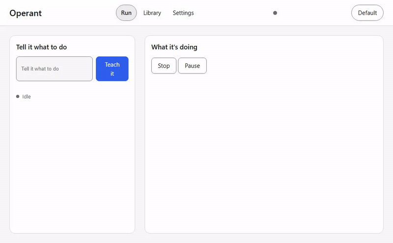
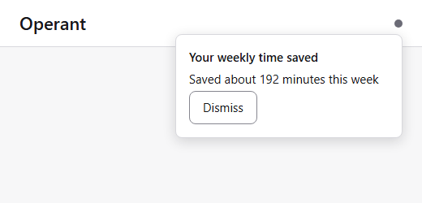

# Operant

[](CONTRIBUTING.md#building-and-testing)
[](LICENSE)
[](docs/ARCHITECTURE.md)
[](docs/PRD.md)

**Teach your computer once. It does it forever.**
*No code. No cloud. Free.*

Operant is a free, open source desktop app for Windows. Describe a task once, in
plain language, and pick which open app it should run in. A model works the task
out live on your screen while you watch, and Operant freezes that successful run
into a workflow it can repeat on its own, with no model and nothing sent anywhere.


[Download the installer](https://github.com/AlpharomeroJL/operant/releases) | [Watch the 90-second demo](#watch-demo) | [Star the repo](https://github.com/AlpharomeroJL/operant) | [Browse the template gallery](https://github.com/AlpharomeroJL/operant-registry) | [See the cookbook](cookbook/README.md)

### Teach it

Describe a task in plain language and pick which open app it should run in. A
model drives it live on your desktop while each step lands in the flight recorder
in front of you. When the run works, Operant saves it as a workflow it can repeat
exactly.

<a id="watch-demo"></a>



### Trust it

A kill switch stops everything in under a tenth of a second, every run can be
undone, and once it has learned a task it does that task again on your own
machine with nothing sent anywhere.


### Forget it

Run a saved task again with one click, any time. Running it on a schedule with no
click at all is on the roadmap: the scheduler is built and tested, but starting a
schedule from the app is not wired up yet (see [Known issues](docs/KNOWN_ISSUES.md)).


## Get started

1. Download the installer.
2. Sign in, or pick a free engine.
3. Teach it your first task.

Building from source instead of installing: see [CONTRIBUTING.md](CONTRIBUTING.md).

---

## How it works

Everything below is for people who want the technical detail: the reasoning,
the architecture, and how Operant compares to other projects.

The model is a compiler, not a runtime. Exploration should be probabilistic.
Execution should not be. At 98 percent per-step model accuracy, a 40-step workflow
fails about 55 percent of the time in production: probabilistic execution does not
survive multiplication. So Operant explores a task with a model once, or a few times
with correction, then freezes the successful run into a typed, readable file guarded
by invariant gates. Replay after that makes zero model calls and zero network calls,
both asserted in CI, not just promised.

### Kill switch and undo

Two things hold no matter what Operant is doing.

**One key stops everything, instantly.** The kill switch runs at the action layer,
below the planner, so no model decision can delay it. CI holds the freeze under
100 ms, and a full-screen overlay drops over the desktop inside that same budget:
it is pre-built and hidden, so revealing it is a single toggle that never waits on
anything being constructed.


**Every run can be undone.** Write actions record an inverse before they run, so
"Undo last run" is a real replay of real inverses, narrated in plain English.
Anything without a safe inverse, like a sent email, is labeled irreversible before
you run it, not after.


Operant also keeps score.  is the tray showing estimated
time saved this week, the screenshot people actually share. If it saves you time,
[star the repo](https://github.com/AlpharomeroJL/operant).

### Explore once, replay forever

 is a live teach run with the model indicator on.
 is the same task run again with the model indicator off. Same
result, second run instant.

```text
EXPLORE (probabilistic, model in loop)             REPLAY (deterministic, no model)
 perceive -> plan(LLM) -> gate -> act -> record     load workflow -> gate -> act -> gate ...
 slow, costly, supervised                           fast, free, offline, audited
                    \                                 ^                    |
                     \        compile                /            drift?  v
                      +------------------------------+        re-ground one step (model)
                                                              -> patch diff -> human approve
                                                              -> versioned merge
```

When a compiled step fails because the screen changed, Operant re-grounds that one
step, proposes a patch diff, and waits for a human approval before merging a new
version. The workflow heals. It never silently mutates.

### What a compiled workflow looks like

This is the actual compiler fixture, unedited, from
[`contracts/fixtures/workflow_notepad/workflow.ts`](contracts/fixtures/workflow_notepad/workflow.ts):

```typescript
// Compiled by Operant from run 01JZFIXTURERUN0000000000
// Goal: Write an invoice note in Notepad and save it
// This file is the canonical compiler OUTPUT shape: declarative, one step per
// statement, plain-English intent on every step, zero model calls at replay.
import { defineWorkflow, step, input } from "@operant/sdk";

export default defineWorkflow({
  name: "notepad-invoice-note",
  version: "1.0.0",
  description: "Writes a dated invoice note into Notepad and saves it.",
  inputs: {
    invoice_date: input.date({ default: "2026-07-11", label: "Invoice date" }),
    amount: input.currency({ default: "142.50", label: "Amount" }),
  },
  steps: [
    // 1. Click the text editor
    step.click({
      intent: "Click the text editor",
      window: { process: "notepad.exe", titlePattern: ".* - Notepad" },
      selectors: [
        { kind: "automation_id", value: "RichEditD2DPT" },
        { kind: "name_role_path", path: [{ role: "window", name: "Untitled - Notepad" }, { role: "document", name: "Text editor" }] },
        { kind: "ordinal_path", path: [{ role: "window", ordinal: 0 }, { role: "document", ordinal: 0 }] },
      ],
      risk: "read",
    }),
    // 2. Type the invoice note
    step.type({
      intent: "Type the invoice note",
      window: { process: "notepad.exe", titlePattern: ".* - Notepad" },
      selectors: [
        { kind: "automation_id", value: "RichEditD2DPT" },
        { kind: "name_role_path", path: [{ role: "window", name: "Untitled - Notepad" }, { role: "document", name: "Text editor" }] },
        { kind: "ordinal_path", path: [{ role: "window", ordinal: 0 }, { role: "document", ordinal: 0 }] },
      ],
      text: "Invoice {invoice_date} total ${amount}",
      risk: "write",
    }),
    // 3. Wait for the screen to update
    step.wait({
      intent: "Wait for the screen to update",
      scope: { window: { process: "notepad.exe", titlePattern: ".* - Notepad" } },
      timeoutMs: 5000,
    }),
    // 4. Save the file
    step.key({
      intent: "Save the file",
      window: { process: "notepad.exe", titlePattern: ".* - Notepad" },
      combo: "ctrl+s",
      risk: "write",
    }),
    // 5. Wait for the screen to update
    step.wait({
      intent: "Wait for the screen to update",
      scope: { window: { process: "notepad.exe", titlePattern: ".* - Notepad" } },
      timeoutMs: 5000,
    }),
    // 6. Check that the note was written
    step.assert({
      intent: "Check that the note was written",
      window: { process: "notepad.exe", titlePattern: ".* - Notepad" },
      expr: {
        op: "matches",
        query: { kind: "snapshot_element_value", role: "document", name: "Text editor" },
        regex: "^Invoice \\d{4}-\\d{2}-\\d{2} total \\$\\d+\\.\\d{2}$",
      },
    }),
  ],
});
```

Every step carries a plain-English `intent` string. That is not a comment for
developers only: it is the same text the plain-English workflow view shows a
non-coder, from the same file, with no separate copy that could drift from the real
logic.

### Architecture

Two execution modes over one runtime:

- **Perception**: Windows accessibility tree (UIA) first, CDP for browsers, OCR for
  PDFs and images, a vision-grounding fallback for anything else. Every vision step
  stores an anchor image, so replay resolves by template match, never by calling a
  model.
- **Action**: a typed, serializable Action IR for every step, with a risk class of
  read, write, or destructive. Adapters (shell, filesystem, Office COM, email,
  browser, MCP) win over raw accessibility actions, which win over vision.
- **Compiler and drift repair**: normalizes a recorded run, turns varying literals
  into typed inputs, scores selectors for stability, and emits a TypeScript file plus
  a signed manifest. A failed replay step re-grounds itself, proposes a patch, and
  waits for human approval before merging.
- **Invariant gates**: precondition, postcondition, and safety checks run in both
  explore and replay. Hard safety invariants (credential fields, payment or delete
  confirmations) live in the runtime, not in workflow files, and no workflow can turn
  them off.
- **Safety and audit**: capability grants per workflow, a dry-run mode with zero side
  effects, and a hash-chained append-only audit log with JSON and PDF export.
- **Orchestrator and models**: bring your own backend across local runners, API keys,
  and sign-in-with-subscription, or run fully offline. The app you download builds a
  real backend straight from your config; the scripted mock is a test fixture, never
  the execution path that ships.
- **Voice**: local speech in and out, lazy-loaded so it does not sit in memory until
  used.
- **Shell UI**: tray, global-hotkey command palette, a target-app picker so a taught
  task binds to the app you mean and not to Operant, and a run viewer with a model
  on/off indicator. During a run the viewer shows a live readout of the real
  model-call count, read from a measured counter, so replay's zero is a fact it can
  show you, not a label painted on. A plain-English workflow view has a code toggle
  for anyone who wants it. The flight recorder also shifts material with state, warm
  and alive while a model explores, still and sharp on model-free replay: honest
  look-and-feel, with fallbacks for reduced transparency and reduced motion.

Full component specs and the data model: [docs/ARCHITECTURE.md](docs/ARCHITECTURE.md).

### Registry

`operant install <name>` reads a workflow manifest from a git-backed index,
verifies its Ed25519 signature against a publisher key, shows the grants it needs in
plain language, and installs only after approval. The index is a local checkout
today; fetching it over the network is not wired yet (see
[Known issues](docs/KNOWN_ISSUES.md)). Unsigned or unverified workflows still
install, but run in dry-run only until you explicitly promote them after reading the
steps.

Registry: [github.com/AlpharomeroJL/operant-registry](https://github.com/AlpharomeroJL/operant-registry).

### MCP, CLI, and SDK

MCP runs both directions. Operant serves every compiled workflow as an MCP tool
(`workflow_<slug>`, schema taken straight from the manifest's own inputs), and it
consumes external MCP servers as adapters your workflows can call. A TypeScript SDK
sits on the same file format as the CLI:

`operant run|compile|dry-run|list|install|bench|doctor|explain`

Details: [docs/specs/mcp.md](docs/specs/mcp.md).

## How Operant compares

Checked against each project's own public documentation. "Not documented" means no
public evidence either way was found, not a claim that the feature is absent;
corrections are welcome as an issue. Last checked: 2026-07-11.

| | Operant | Simular | UI-TARS Desktop | Open Interpreter | UFO |
|---|---|---|---|---|---|
| Deterministic, model-free replay | Yes, CI-asserted | No, cloud execution | No, re-infers every step | No, re-infers every step | No, re-infers every step |
| Works fully offline after teaching | Yes | No | Partial | Partial | Partial |
| Self-heals on UI drift, human-approved | Yes | Not documented | Not documented | Not documented | Not documented |
| Full audit trail, hash-chained, exportable | Yes | Not documented | Not documented | Not documented | Not documented |
| No-code path for non-developers | Yes, wizard plus plain-English steps | Yes | No, developer tool | No, developer tool | No, research framework |
| One-click undo | Yes | Not documented | No | No | No |
| Kill switch under 100ms | Yes, latency-tested | Not documented | No | No | No |
| Price | Free, Apache 2.0 | Paid, per-seat | Free, open source | Free, open source | Free, research license |
| Raw exploration-time model quality | Conceding: dedicated grounding teams are likely ahead here | n/a | n/a | n/a | n/a |
| Mobile device control | Conceding: not at v1.0.0 | Not documented | No | No | No |

This table is kept in sync with the one in LAUNCH.md.

## License and links

- License: [Apache 2.0](LICENSE)
- Contributing: [CONTRIBUTING.md](CONTRIBUTING.md)
- Security policy: [SECURITY.md](SECURITY.md)
- Docs: [alpharomerojl.github.io/operant](https://alpharomerojl.github.io/operant/)
- Registry: [github.com/AlpharomeroJL/operant-registry](https://github.com/AlpharomeroJL/operant-registry)
- Repo: [github.com/AlpharomeroJL/operant](https://github.com/AlpharomeroJL/operant)
