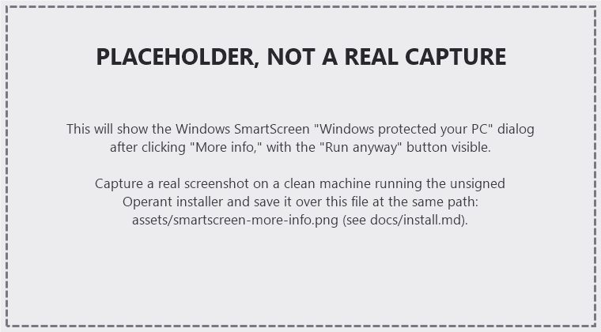

# Installing Operant on Windows

## Download and verify

1. Download the installer, `Operant_<version>_x64-setup.exe`, from the
   [releases page](https://github.com/AlpharomeroJL/operant/releases).
2. Optionally verify the download against the `SHA256SUMS` file attached to
   the same release before running it:

   ```
   certutil -hashfile Operant_<version>_x64-setup.exe SHA256
   ```

   Compare the printed hash to the matching line in `SHA256SUMS`.

## Run the installer

Double-click `Operant_<version>_x64-setup.exe`. It offers a per-user
install (no administrator rights needed, the default) or an all-users
install. Either way, before setup itself appears you will very likely see
a Windows SmartScreen warning first. That is expected; read on.

## The "Windows protected your PC" warning

Operant's installer is not yet signed with a Windows code-signing
(Authenticode) certificate; see `docs/signing.md` for why, and what it
takes to change that. Without one, Windows SmartScreen cannot vouch for the
publisher, so it shows a blocking-looking, but harmless-to-dismiss, warning
the first time anyone runs the installer:

> **Windows protected your PC**
> Microsoft Defender SmartScreen prevented an unrecognized app from
> starting. Running this app might put your PC at risk.
>
> App: Operant_\<version\>_x64-setup.exe
> Publisher: Unknown publisher

To continue:

1. Click **More info**. The dialog expands to show the publisher and file
   name, and a new button appears.
2. Click **Run anyway**.



*(Screenshot placeholder: `assets/smartscreen-more-info.png` has not been
captured yet. Once a real SmartScreen dialog is captured on a clean
machine, save it at that path and this placeholder note can be removed.)*

Setup then proceeds normally, and you will not see this warning again for
that specific installer file (SmartScreen remembers files it has already
let you run, by hash).

### Why this happens, and why it is safe to proceed

SmartScreen's warning is about the installer's **publisher identity**, not
about a known threat: it has no reputation data for an installer nobody
has signed, so it warns on every unsigned app equally, malicious or not.
Operant's safety here does not depend on that missing OS-level signature:

- Every automatic update Operant downloads is verified against this
  project's Ed25519 key before it is applied (see `release/KEYS.md`); a
  tampered or substituted update fails that check and is rejected.
- The `SHA256SUMS` file attached to every release lets you verify the
  installer bytes yourself before running it, independent of Windows.
- The project is open source; the source that produced this build is
  public.

If you would rather not click through the warning, you can wait for a
signed release (see `docs/signing.md` for the plan to get there), or build
Operant yourself from source (`release/REPRODUCIBLE.md`).

This is also tracked honestly in `docs/KNOWN_ISSUES.md` under
"Installation and updates," alongside the other rough edges in the current
release.

## Reinstalling and uninstalling

Reinstalling over an existing copy triggers one Windows permission (UAC)
prompt; this is separate from the SmartScreen warning above and is normal
for any installer that writes to a protected location. Uninstalling does
not trigger a UAC prompt. The uninstaller also offers to remove your saved
data; see `docs/KNOWN_ISSUES.md` for its current verification status.
